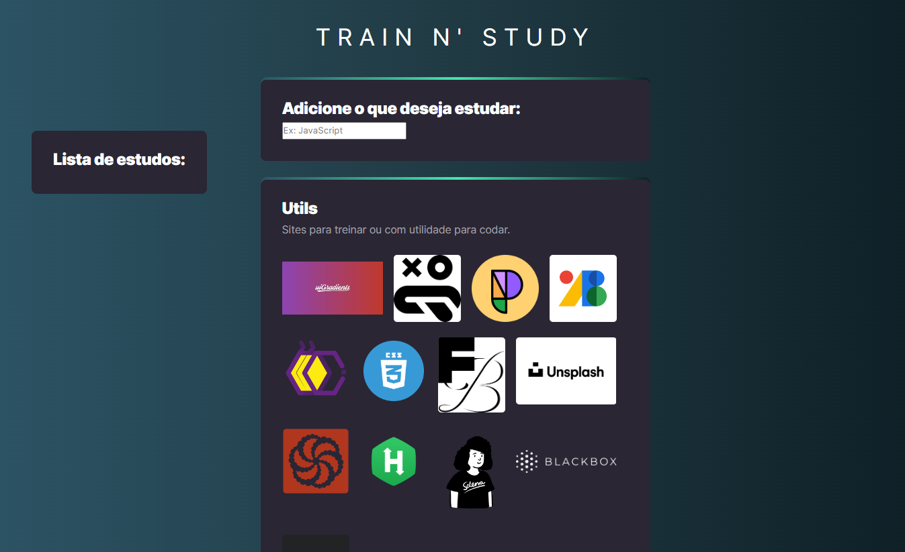

# Página com utilidades

> Projeto Pessoal

O projeto foi feito para meu estudo pessoal, nele há diversos links de vídeos com tutoriais de CSS, sites com utiliades para programação no geral e uma lista para anotar o que estudar ou reforçar.

## [🔗 Clique aqui para acessar o projeto](https://loren175.github.io/train-n-study)

#

## 🚀 Tecnologias

- HTML
- CSS
- JavaScript
- Git e Github

## 📞 Contato

> rafael.loren175@gmail.com

> +55 (11) 99959-9140

## 👾 Discord

> rafas#7622